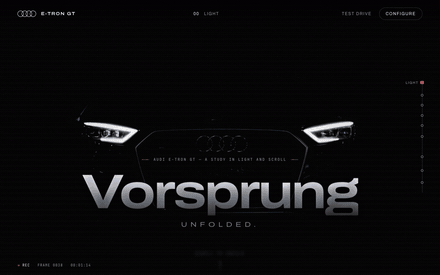
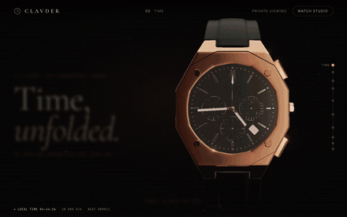
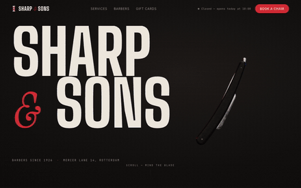

 

I'm Ruslan, a developer from Ukraine 🇺🇦. I design backends that stay fast and maintainable as they grow, mostly on **Laravel**, and I build frontends people remember: real-time 3D, scroll-driven motion, and interfaces where every button does something.

  
  

## Selected work

Three concept sites, all rendered live in the browser. No video, no templates. Click a preview to open it.

<table>
  <tr>
    <td width="33%" valign="top">
      
       <b>Audi e-tron GT</b>
       One continuous 3D shot driven by scroll. The car comes apart panel by panel and changes paint mid-frame. Working configurator with a shareable build link.
    </td>
    <td width="33%" valign="top">
      
       <b>Clavder Octa</b>
       A chronograph that shows your real time. Scroll opens the case down to a ticking escapement. Chronograph runs from 3D pushers, caseback engraving renders live.
    </td>
    <td width="33%" valign="top">
      
       <b>Sharp &amp; Sons</b>
       A straight razor slices the headline in half. Full booking flow with free slots, calendar export and a gift card generator.
    </td>
  </tr>
</table>

## Stack

## What I do

| | |
|---|---|
| **Backend** | APIs and business logic on Laravel and Symfony, database design, integrations, performance work |
| **Frontend** | React interfaces, Three.js / WebGL scenes, scroll-driven animation, 60 fps on real devices |
| **Delivery** | From first schema to deployed product: architecture, code, optimisation, launch |

## Contact

  <a href="mailto:fairstack@proton.me"><b>fairstack@proton.me</b></a> ·
  <a href="https://t.me/back_front_dev">Telegram</a> ·
  <a href="https://instagram.com/fairstack.development">Instagram</a> ·
  <a href="https://portfolio.fairstack.dev">Portfolio</a> ·
  <a href="https://fairstack.dev">fairstack.dev</a>

